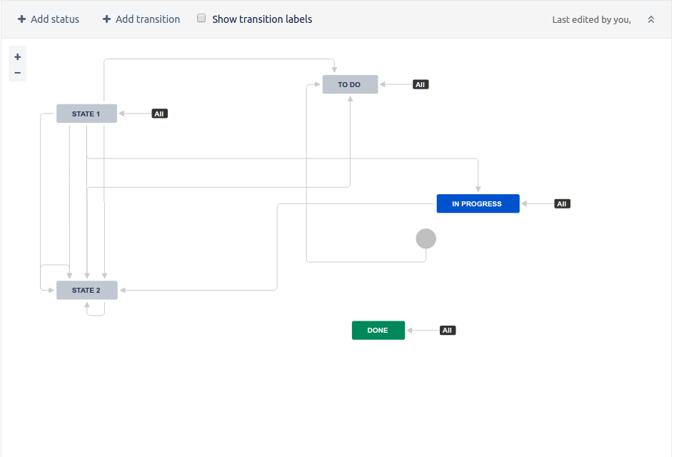

# FSM GUI

## Visual representation

As an example of not bad implemented workflow editor we suggest JIRA's workflow designer.



See **wokflow designer** chapter at official JIRA [documentation](https://confluence.atlassian.com/jira064/configuring-workflow-720412524.html) for more details

### Existing react libraries

#### [The Graph Editor](https://github.com/flowhub/the-graph)

* 503 stars on github; Sep 2013 - Jul 2017; MIT License; more-less actively maintained
* Focus on graphs used for dataflow and Flow-based programming
* Pure documentation (Some docs can be found at maintainer-company [product docs](https://noflojs.org/documentation/graphs/))
* Has tests written in CoffeeScript

```
           ――――――――――――――――――
           |                |
In port 1  *                *  Out port 1
           |                | 
           |                | 
In port 2  *   Node icon    *  Out port 2
           |                | 
           |                | 
In port 3  *                *  Out port 3
           |                |
           ――――――――――――――――――
           |   Node title   | 
           ――――――――――――――――――
```

**There is no sense to consider this library because :**

* Nodes can be connected in only `Out port => In port` ports relations - it's not what we need

#### [STORM React Diagrams](https://github.com/projectstorm/react-diagrams)

* 272 stars on github; May 2016 - Jul 2017; MIT License; 
* Written in TypeScript. Author's comment below:

> Because it can transpile into any level of ECMA Script, and the library got really complicated, so I ported it to Typescript to accommodate the heavy architectural changes I was starting to make. <3 Type Script

* Has a [fork](https://github.com/woodenconsulting/react-js-diagrams) in JavaScript
* Well readable source code
* Pure documentation
* Has no tests
* Support custom node types

### Non-React based

  * http://modeling-languages.com/javascript-drawing-libraries-diagrams/
  * [d3](https://d3js.org/) - [isn't a good choice for our task](https://stackoverflow.com/questions/22226849/can-i-create-a-flow-chart-no-tree-chart-using-d3-js)
